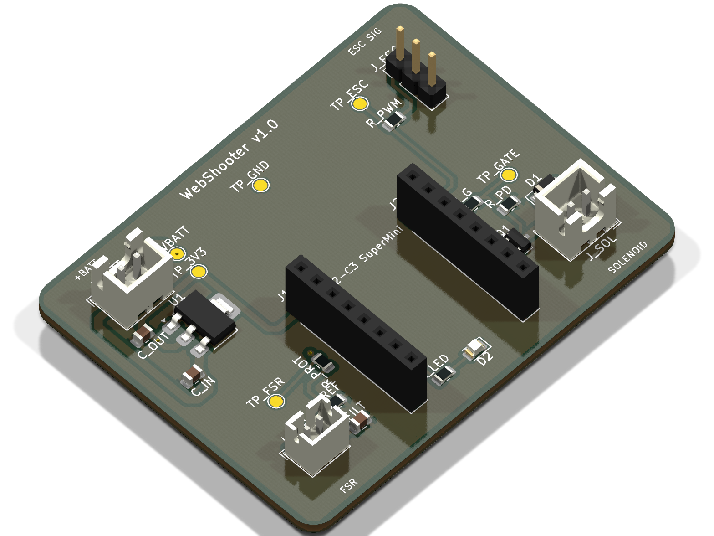
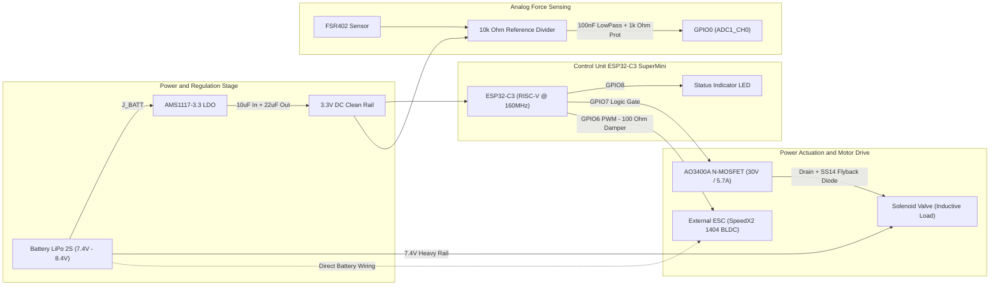
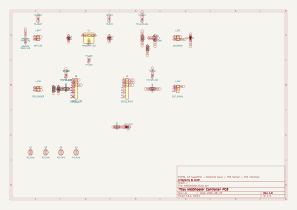
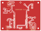
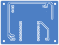
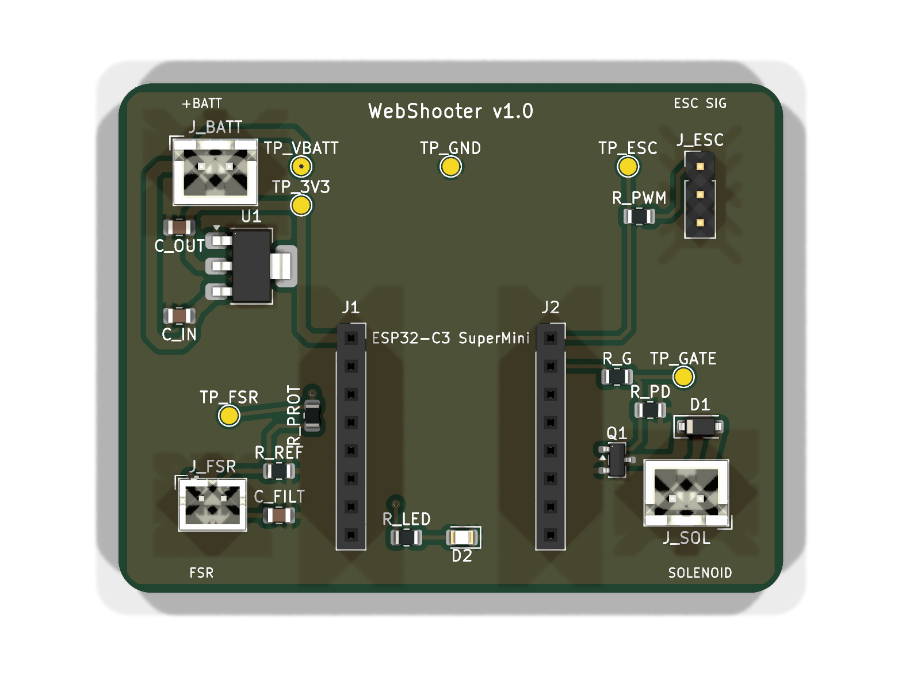
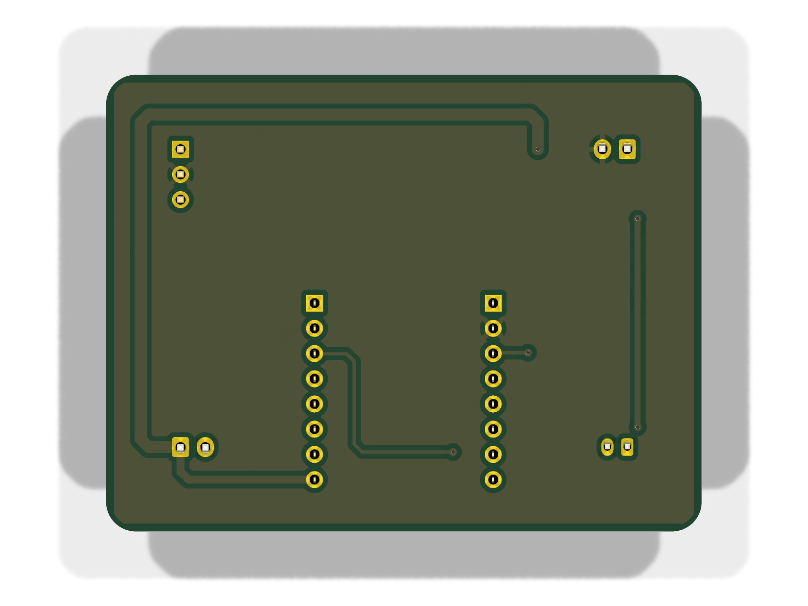

# 🕸️ WebShooter — Wearable Actuation & High-Response Sensing PCB

<div align="center">

[](https://www.kicad.org/)
[](https://freedomdefined.org/OSHW)
[]()
[]()
[](LICENSE)

</div>

<p align="center">
  
</p>

---

## 1. 🎯 Objective

**WebShooter** is a compact, high-reliability wearable controller PCB designed for rapid biosignal/force acquisition, low-latency electronic valve actuation, and external brushless motor ESC control.

Built around the **ESP32-C3 SuperMini** (RISC-V 32-bit architecture), the system is engineered to withstand intense inductive transients and severe electromagnetic interference (EMI) from high-power loads while providing precision analog readings from a Force Sensing Resistor (FSR).

> [!NOTE]
> **Key Capabilities:**
> - **Fast Response Time:** Sub-millisecond analog force detection via hardware RC filtering.
> - **Inductive Load Immunity:** High-speed Schottky flyback suppression and isolated ground return loops.
> - **Modular Design:** Socketed MCU mounting for effortless replacement and maintenance.

---

## 2. 🏗️ System Architecture



- **MCU:** ESP32-C3 SuperMini (RISC-V 32-bit single-core @ 160 MHz, 400 KB SRAM, 4 MB Flash, Wi-Fi + BLE 5).
- **Analog Front-End (AFE):** Precision voltage divider with a 100 nF ceramic low-pass filter ($f_c \approx 159\text{ Hz}$) and $1\text{ k}\Omega$ series current limiter.
- **Power Management & Drive:** AMS1117-3.3 LDO regulator with dual ceramic filtering; logic-level AO3400A N-MOSFET with SS14 Schottky flyback protection; isolated ESC PWM signaling.

---

## 3. 🔬 Component Selection & Design Decisions

| Subsystem | Component Selected | Engineering Rationale & Justification |
| :--- | :--- | :--- |
| **Microcontroller** | **ESP32-C3 SuperMini** | Ultra-compact footprint ($22.5 \times 18\text{ mm}$), native 12-bit ADC, hardware PWM timers, low power consumption, and integrated 2.4 GHz Wi-Fi/BLE for wireless telemetry. Mounted on **2.54 mm female headers** (`J1`, `J2`) to prevent module thermal stress during assembly and allow instant replacement. |
| **Solenoid Driver** | **AO3400A N-MOSFET** (SOT-23) | Ultra-low on-resistance ($R_{DS(on)} < 33\text{ m}\Omega$ @ $V_{GS} = 2.5\text{V}$), fully saturated with the ESP32's 3.3V logic. At $I = 0.8\text{A}$, power dissipation is negligible ($P_{cond} \approx 21.1\text{ mW}$), eliminating the need for bulky heatsinks. |
| **Flyback Protection** | **SS14 Schottky Diode** (SOD-123) | Placed directly in antiparallel across the solenoid terminals. Ultrafast reverse recovery ($t_{rr} < 10\text{ ns}$) and $0.5\text{V}$ forward drop clamp inductive voltage spikes ($V = -L \frac{di}{dt}$) to protect the MOSFET drain and ground plane from EMI bursts. |
| **Voltage Regulator** | **AMS1117-3.3** (SOT-223) | Handles 7.4V–8.4V LiPo 2S input with 1A current capacity. SOT-223 tab is tied to the output plane for optimal thermal dissipation. Paired with $10\,\mu\text{F}$ input and $22\,\mu\text{F}$ output ceramic X7R capacitors. |
| **Force Sensor AFE** | **FSR402 Divider + RC Filter** | Converts pressure ($0.2\text{ N} - 20\text{ N}$) into a clean $0.03\text{V} - 3.0\text{V}$ voltage curve. The hardware RC filter ($10\text{ k}\Omega \parallel 100\text{ nF}$) removes mechanical contact bounce and EMI from nearby motor switching. |
| **Motor & ESC Isolation** | **Signal-Only PWM Interface** | Heavy motor currents (up to 15A from the SpeedX2 1404 BLDC) are powered **directly from the battery pack wiring harness**. Only the PWM control line and reference ground pass through the PCB, preventing ground bounce and motor hash from corrupting the ADC. |

---

## 4. 📐 Schematic Overview

<div align="center">
  <a href="schematic/WebShooter_Schematic.pdf">
    
  </a>
  <p><em>Full vector PDF schematic is available in the <a href="schematic/WebShooter_Schematic.pdf"><code>/schematic</code></a> folder.</em></p>
</div>

> [!TIP]
> **Complete Schematic Documentation:**
> - 📄 **PDF Format:** [`schematic/WebShooter_Schematic.pdf`](schematic/WebShooter_Schematic.pdf)
> - 🎨 **Vector SVG:** [`schematic/WebShooter_Schematic.svg/`](schematic/WebShooter_Schematic.svg/)
> - 💻 **KiCad Source:** [`pcb/WebShooter.kicad_sch`](pcb/WebShooter.kicad_sch)

---

## 5. 🖨️ PCB Layout & Routing Strategy

<div align="center">

| Top Layer 2D Layout (F.Cu) | Bottom Layer 2D Layout (B.Cu) |
| :---: | :---: |
|  |  |

| 3D Render - Top Side | 3D Render - Bottom Side |
| :---: | :---: |
|  |  |

</div>

### 🛠️ Layer Stackup & Dimensions
- **Layer Count:** 2-Layer FR4 ($1.6\text{ mm}$ board thickness, $1\text{ oz} / 35\,\mu\text{m}$ copper weight).
- **Board Dimensions:** $38.0\text{ mm} \times 38.0\text{ mm}$ with $2.0\text{ mm}$ corner radius fillets (Ultra-compact wearable standard).
- **Mounting Hole Grid:** 4x M2 mounting holes on a $31.0 \times 31.0\text{ mm}$ pattern ($3.5\text{ mm}$ from board edges).

### 📐 Routing Guidelines & DFM Standards Applied
1. **Strict 45° Mitered Routing (Zero 90° Corners):**
   - All track bends utilize **45-degree chamfers** or smooth radii.
   - *Why:* Eliminates **acid traps** during chemical etching in fab, avoids acute impedance steps, and prevents solder mask delamination.
2. **Edge Pullback Clearance ($\ge 1.0\text{ mm}$):**
   - All copper tracks, vias, and copper pour zones maintain at least **$1.0\text{ mm}$ of clearance** from the `Edge_Cuts` perimeter.
   - *Why:* Prevents copper shearing, burrs, and shorts during CNC V-scoring and board routing.
3. **Trace Width Dimensioning (IPC-2152):**
   - **Power & Solenoid Traces:** $1.0\text{ mm} - 1.2\text{ mm}$ (Handles up to $3\text{A}$ continuous with $\Delta T < 10^\circ\text{C}$).
   - **3.3V Power Distribution:** $0.8\text{ mm}$.
   - **Digital PWM & Analog Signals:** $0.35\text{ mm} - 0.40\text{ mm}$.
4. **Dual Continuous Ground Planes:**
   - Both `F.Cu` and `B.Cu` feature unbroken GND copper zones connected through thermal reliefs (`ZONE_CONNECTION_THERMAL`) on all through-hole and SMD ground pins.

---

## 6. ✅ DRC & Quality Verification

Automated Design Rule Check (DRC) executed via `kicad-cli`:

```text
** KiCad 10 Design Rule Check Report **
Project: WebShooter.kicad_pcb
Date: 2026-08-20

[+] Status: PASSED
[+] Total DRC Violations: 0
[+] Unconnected Elements: 0
[+] Footprint Courtyard Overlaps: 0
[+] Solder Mask Bridges: 0
[+] Silk Over Exposure: 0
```

> [!IMPORTANT]
> The full verification report is saved in [`pcb/WebShooter-drc.rpt`](pcb/WebShooter-drc.rpt).

---

## 7. 🧊 3D Model & Mechanical Integration

<p align="center">
  
</p>

- **PCB 3D Model:** Ready-to-import STEP file:
  - 📁 [`3d-model/WebShooter.step`](3d-model/WebShooter.step)
- **Wearable Case / Enclosure (CAD):** Parametric wrist case model for 3D printing:
  - 📦 [`3d-model/WEBSHOOTERCASEFINAL.f3d`](3d-model/WEBSHOOTERCASEFINAL.f3d) (Autodesk Fusion 360 source archive)
- **Mechanical Mounting:** 4x M2 mounting holes on a $31.0 \times 31.0\text{ mm}$ square grid ($3.5\text{ mm}$ edge offset), designed to mate directly with the 3D-printed enclosure standoffs.

---

## 8. 🏭 Manufacturing & Assembly (JLCPCB / PCBWay Ready)

| Asset | Location / File | Purpose |
| :--- | :--- | :--- |
| **Gerber Files (ZIP)** | [`gerbers/WebShooter_Gerbers_JLCPCB.zip`](gerbers/WebShooter_Gerbers_JLCPCB.zip) | One-click drag-and-drop file for instant online quoting |
| **Individual Gerbers** | [`gerbers/`](gerbers/) | Standard RS-274X layers (`.gtl`, `.gbl`, `.gts`, `.gbs`, `.gto`, `.gm1`...) |
| **Drill File** | [`gerbers/WebShooter.drl`](gerbers/WebShooter.drl) | Excellon CNC drill specifications |
| **BOM (CSV)** | [`bom/WebShooter_BOM.csv`](bom/WebShooter_BOM.csv) | Component spreadsheet with LCSC Part Numbers |
| **BOM (Markdown)** | [`bom/WebShooter_BOM.md`](bom/WebShooter_BOM.md) | Formatted Bill of Materials table |
| **Case CAD (F3D)** | [`3d-model/WEBSHOOTERCASEFINAL.f3d`](3d-model/WEBSHOOTERCASEFINAL.f3d) | 3D-printable parametric enclosure design |

### 🚀 Production Parameters Recommended
- **Base Material:** FR-4 (Tg 130–140°C).
- **PCB Thickness:** 1.6 mm.
- **Copper Weight:** 1 oz ($35\,\mu\text{m}$).
- **Surface Finish:** HASL Lead-Free or ENIG (Electroless Nickel Immersion Gold).
- **Solder Mask:** Matte Black / Blue / Green.
- **Silkscreen:** High-contrast White.

---

## 📜 License

This project is licensed under the [MIT License](LICENSE) — Feel free to use, modify, and manufacture this board for open-source and commercial hardware projects.
